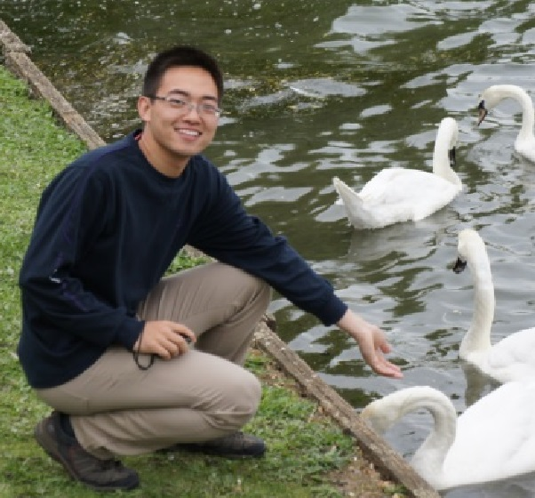

<table border="0">
  <tr>
    <td width="20%"></td>
    <td width="2%"></td>
    <td width="78%">
    Xiaozhao Zhao  
    PhD. student  
    School of Computer Science  
    Tianjin University, China  
    </td>
  </tr>
</table>

My research interests include: 

* stochastic gradient learning for Boltzmann machines;
* context modeling in information retrieval;
* information geometry theory.

